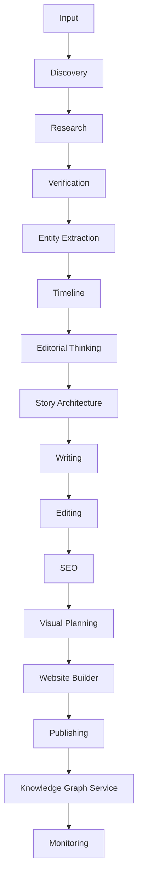

# Architecture

The Breakdown OS follows a modular AI architecture.

Each module has ONE responsibility.

Modules communicate using structured JSON.

No module writes directly to the website.

---

---

## Principles

One Responsibility

↓

Loose Coupling

↓

Structured Data

↓

Reusable Components

↓

Human Review

↓

Scalable Design

---

Every module:

Receives JSON

↓

Processes

↓

Returns JSON
