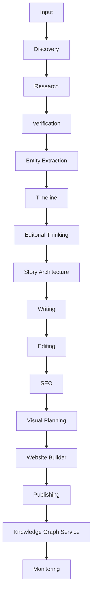

# Architecture

The Breakdown OS follows a modular AI architecture.

Each module has ONE responsibility.

Modules communicate using structured JSON.

No module writes directly to the website.

---



---

## Principles

One Responsibility

↓

Loose Coupling

↓

Structured Data

↓

Reusable Components

↓

Human Review

↓

Scalable Design

---

Every module:

Receives JSON

↓

Processes

↓

Returns JSON

---

## Orchestration Principle

Every major subsystem should have a single orchestration layer and multiple specialized implementation layers.

This architectural identity is strictly enforced across the system. It has been proven successful in:
- Charts (`ChartRenderer` as orchestrator)
- Maps (`MapRenderer` as orchestrator)
- CMS (`StoryEditor` as orchestrator)

Never let a single component act as both orchestrator and implementer.

---

## Registry Pattern

Whenever more than three interchangeable implementations exist, prefer a Registry + Strategy pattern over switch statements.

**Examples**
- Charts
- Maps
- AI Providers
- Analytics Providers
- Search Providers
- Renderers

This becomes a reusable architectural pattern.

### Generic Registry Implementation

As the system matures, registries should adopt a common generic interface rather than disparate implementations:

```typescript
interface Registry<T> {
  register(name: string, item: T): void
  get(name: string): T | undefined
  list(): string[]
}
```

This ensures charts, maps, AI providers, analytics plugins, and future block types all share the exact same conceptual model.

---

## Visualization Engines

Visualization engines should separate:
- data
- configuration
- rendering
- interaction
- presentation

No visualization component should own all five responsibilities.

This will apply to maps, globes, charts, timelines, and future visualizations.
