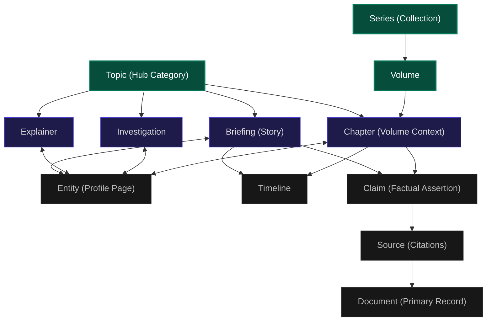

Current Ticket:
TASK-03

Status:
Completed

Objective:
Define the canonical content-type taxonomy and relationship models for public engagement and indexing.

Blocked By:
None

Depends On:
TASK-02 — Technical SEO, Canonicalization & Evidence Integrity (COMPLETED)

Acceptance Criteria:
✓ Canonical public labels defined for key content types.
✓ Entity-relationship models documented outlining information flow.

Definition of Done:
All taxonomy and mapping requirements satisfied.

---

# THE BREAKDOWN: CANONICAL CONTENT-TYPE TAXONOMY & RELATIONSHIPS

Version: 1.0  
Status: Drafted  
Governance Level: 4 (Project Deliverable)  

This document outlines the core content types utilized by The Breakdown and details their structural relationships to maintain consistent indexing and clear reader expectations.

---

## 1. Public Content-Type Taxonomy

To ensure progressive disclosure and reduce confusion, we limit the public content-type labels to a strict, highly descriptive taxonomy:

| Content Type | Public Label | Internal Structure | Purpose / Scope | Target SEO Intent |
| :--- | :--- | :--- | :--- | :--- |
| **Briefing / Story** | **Briefing** | Standalone Story | Dynamic, current-affairs reporting outlining what happened and what the evidence shows. | Query: Current events, breaking news context |
| **Explainer** | **Explainer** | Standalone Story | Evergreen educational articles clarifying structural policy, institutions, or economic trends. | Query: "How does X work?", "What is Y?" |
| **Investigation** | **Investigation** | Standalone / Multi-part | Original research uncovering systemic failures, backed by deep data audits and evidence. | Query: High-impact disclosures, audits |
| **Chapter** | **Chapter** | Library Chapter | Authoritative, curated textbook chapters charting India's strategic, geopolitical, and legal history. | Query: Indian history, core policies |
| **Topic** | **Topic** | Topic Hub | Subject-level category page aggregating briefings, explainers, chapters, and entities. | Query: Broad category terms ("Economy India") |
| **Entity** | **Profile** | Entity record | Contextual dossier mapping a person, company, program, company, or ministry's record. | Query: "Who is X?", "What is scheme Y?" |
| **Document** | **Document** | Primary Document | Verified, archived primary-source text (PDFs, transcripts, reports) linked directly to claims. | Query: Source validation, raw data |
| **Timeline** | **Timeline** | Chronology Block | Chronological tracking of events under a specific briefing or chapter. | Query: Timeline history, event tracking |

---

## 2. Information Relationship Graph

The information flow is designed as a strict directed acyclic graph (DAG) to ensure absolute structural consistency. No UI component computes relationships; they are derived from registry models:

---

## 3. Relationship Integrity Constraints

To prevent empty directories and broken paths, all relations must obey these constraints:
1. **No Orphan Claims**: Every claim must be attached to at least one briefing or chapter.
2. **Deterministic Hashing**: Standalone story claims utilize a hash-derived ID (`deterministicClaimId`) to ensure data preservation if mapped to the global Claim Registry in the future.
3. **Source Verification**: Every source must have an assigned reliability tier (1-6) and map to a parent entity where possible.
4. **Reciprocal Linking**: Every entity profile page must automatically link back to all articles (briefings, chapters, explainers) that reference it in their block data.
