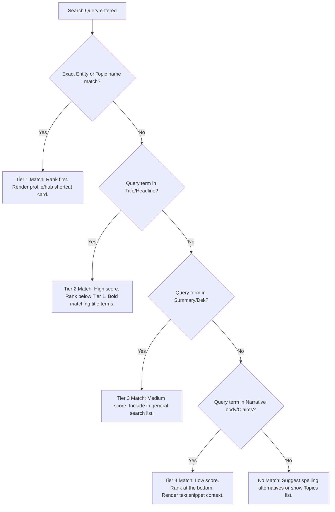

Current Ticket:
TASK-03

Status:
Completed

Objective:
Specify the on-site search architecture and search results prioritization algorithm constraints.

Blocked By:
None

Depends On:
TASK-02 — Technical SEO, Canonicalization & Evidence Integrity (COMPLETED)

Acceptance Criteria:
✓ On-site search indexing scope defined.
✓ Search result prioritization rules established.

Definition of Done:
All search architecture requirements satisfied.

---

# THE BREAKDOWN: SEARCH INDEX & RESULTS PRIORITIZATION

Version: 1.0  
Status: Drafted  
Governance Level: 4 (Project Deliverable)  

This document defines the on-site search indexing guidelines and search result matching logic to help readers find specific briefings, topics, entities, and primary source documents.

---

## 1. Search Indexing Scope

The client-side search system indexes the following content blocks across public registries:

- **Stories / Briefings**: Headline, summary, category, tag tags, and content body blocks.
- **Topics**: Topic title, description, and keyword aliases.
- **Entities**: Entity name, alternative names (aliases), description, and type.
- **Series & Volumes**: Collection title, volume summary, and chapter titles.
- **Primary Documents**: Document title, publisher, and short summary.

---

## 2. Search Result Prioritization Rules

When a user executes a query, the search engine resolves matches using the following scoring hierarchy:

### Weighting Matrix
To compute search rankings programmatically within the client-side system, apply the following weights:
- **Entity/Topic Name Match**: `1.0` (direct match redirects or highlights).
- **Article Headline (H1)**: `0.8`.
- **Article Summary (Dek) / Block Heading**: `0.5`.
- **Paragraph Body text / Claim text**: `0.2`.
- **Source Citation / Document title**: `0.1`.

---

## 3. UI Presentation of Search Results
- **Direct Nav Shortcuts**: If the search query matches an Entity (e.g. "RBI") or Topic (e.g. "Economy") with a confidence of >0.9, render a dedicated **"Direct Profile Match"** card at the top of results.
- **Categorized Tabs**: Segment results into: `All`, `Briefings`, `Library`, `Profiles`, and `Documents` to let readers filter results instantly without executing a new query.
