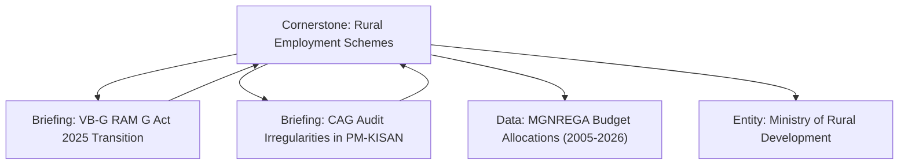
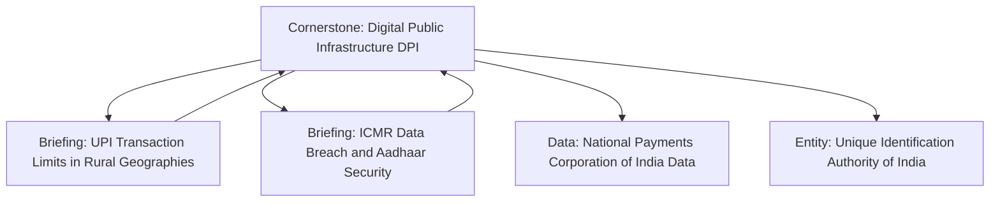
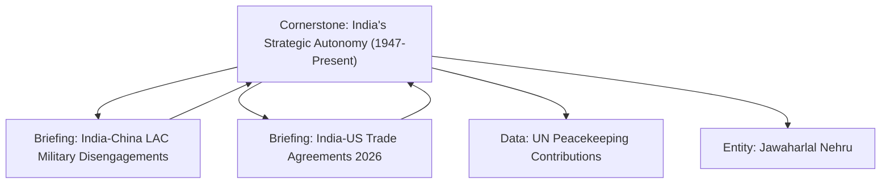

Current Ticket:
TASK-05

Status:
Completed

Objective:
Map content clusters for topics to ensure topic authority and strong internal discovery.

---

# CONTENT CLUSTERS SPECIFICATION

This document outlines the hierarchy and reciprocal linking structures for the primary content clusters.

## 1. Cluster A: Policy & Governance (Rural Welfare & Infrastructure)

## 2. Cluster B: Economy, Technology & Systems (Digital Infrastructure)

## 3. Cluster C: India & the World (Strategic Autonomy & Borders)

