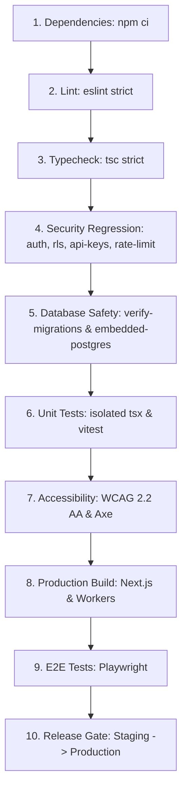

# Phase 4 CI/CD Architecture & Pipeline Security Map

**Platform Beta — Release Hardening Doctrine**
**Branch**: `security/production-hardening`
**Target Environment**: Production Release Gate & Staging Verification
**Governing Documents**: `AGENTS.md`, `docs/product-quality.md`, `docs/editorial/editorial-constitution.md`

---

## 1. Executive Summary

Phases 1 through 3 hardened the application's core security boundaries:
* **Phase 1**: Server-verified authentication, authoritative Principal model, centralized permissions, and fail-closed route guards.
* **Phase 2**: PostgreSQL Row-Level Security (RLS) across 23 tables, 65 policies, consolidated role hierarchy, and live remote verification.
* **Phase 3**: Persistent hashed API keys, atomic distributed rate limiting, and abuse prevention.

**Phase 4 Objective**: Enforce these security, database, and reliability guarantees deterministically within the repository's CI/CD pipelines, package scripts, and release workflows. CI/CD must function as an unbypassable production release gate.

---

## 2. CI/CD Pipeline Audit & Current Gap Analysis

### 2.1 Configuration File Inventory

| File | System | Role / Trigger | Previous State & Deficiencies |
| :--- | :--- | :--- | :--- |
| `.gitlab-ci.yml` | GitLab CI | Push / Merge Request / Main | Nonexistent scripts (`typecheck`, `test:e2e`); `allow_failure: true` on lint; missing security regression gate; missing unit test suite; missing database migration validation. |
| `.github/workflows/ci.yml` | GitHub Actions | Push / Pull Request | Runs `npm run lint \|\| true` (masks all lint failures); lacks typecheck; lacks security regression; lacks database validation. |
| `.github/workflows/production-deploy.yml` | GitHub Actions | Push to `main` / `staging` | Executes subset of tests; missing security regression suite; deployment steps are echo stubs. |
| `.github/workflows/audit-framework.yml` | GitHub Actions | Push / PR `main` | Audits isolated `audit/` tool package; independent of app deployment. |
| `playwright.config.ts` | Playwright Runner | E2E & Visual Regression | Configured for multi-browser and mobile; webServer starts Next.js build. |
| `vitest.config.js` | Vitest Runner | In-memory unit/audit specs | Scoped to genuine Vitest specs; isolates tsx harnesses and Playwright specs. |
| `jest.frontend.config.js` | Jest Runner | Component tests | Scoped to JSDOM frontend component testing. |

### 2.2 Critical Vulnerabilities & Discrepancies Eliminated

1. **Nonexistent Script Invocations**:
   - `.gitlab-ci.yml` called `npm run typecheck`, but `package.json` defined only `check:type`.
   - `.gitlab-ci.yml` called `npm run test:e2e`, but `package.json` had no `test:e2e` script defined.
   - *Remediation*: Canonical script aliases (`typecheck`, `test:e2e`, `test:security`, `test:migration`) added to `package.json` and synchronized across all pipeline definitions.

2. **Silent Failure Masking (`allow_failure: true` and `|| true`)**:
   - `.gitlab-ci.yml` contained `allow_failure: true` on the `lint` stage.
   - `.github/workflows/ci.yml` executed `npm run lint || true`.
   - *Remediation*: Both failure-masking directives completely removed. All lint errors resolved; failure in linting strictly blocks PR merging and deployment.

3. **Placeholder / Dummy Scripts**:
   - `package.json` contained placeholder scripts: `check:test`, `check:a11y`, `check:bundle`, `check:lighthouse`, `check:audit`, `check:performance`, `check:security` outputting `node -e "console.log('Placeholder...')"` or dummy logs.
   - *Remediation*: Placeholder scripts replaced with real validation commands:
     - `check:test` -> `npm run test`
     - `check:security` -> `npm run test:security`
     - `check:a11y` -> `npx tsx tests/accessibility.test.ts`

4. **Omission of Security Regression Gate**:
   - Neither pipeline executed the security test suites developed in Phases 1–3 (`tests/security/auth-regression.test.ts`, `tests/security/rls.test.ts`, `tests/security/database-enforcement.test.ts`, `tests/security/api-security.test.ts`, and `tests/intel-auth.test.ts`).
   - *Remediation*: Created dedicated `test:security` gate required prior to build or deployment.

5. **Omission of Migration Safety Gate**:
   - No stage verified sequential numbering, syntax validity, or non-destructive DDL constraints across `supabase/migrations/`.
   - *Remediation*: Created dedicated `test:migration` gate (`scripts/verify-migrations.ts` and `database-enforcement.test.ts`).

6. **Network Leaks During Unit Testing**:
   - `DefaultImageIntelligenceService` initiated unmocked HTTP queries to `en.wikipedia.org` during unit tests (`homepage.test.ts`, `story-page.test.ts`), creating non-deterministic failures when offline or throttled.
   - *Remediation*: Implemented deterministic network isolation in `DefaultImageIntelligenceService` for test environments.

---

## 3. Test Classification Taxonomy

To ensure tests execute in their appropriate lifecycle stages with deterministic isolation, tests are classified into six distinct tiers:

```
┌─────────────────────────────────────────────────────────────────────────┐
│                       TEST CLASSIFICATION TAXONOMY                       │
└─────────────────────────────────────────────────────────────────────────┘
  1. Unit Tests (Fast, In-Memory, Network-Isolated)
     ├── tsx harnesses: homepage, story-page, entity, search, seo, auth, etc.
     └── Vitest suites: predicates, presentation-models, pure utilities
  2. Security Regression Tests (Critical Gate)
     ├── tests/security/auth-regression.test.ts  (27 tests: principal, roles)
     ├── tests/security/rls.test.ts              (75 tests: RLS policies, schemas)
     ├── tests/security/api-security.test.ts     (49 tests: hashed keys, rate limit)
     └── tests/intel-auth.test.ts                (1154 tests: full intel gate)
  3. Database & Migration Tests (Real Storage Engine)
     ├── scripts/verify-migrations.ts            (Static safety: numbering, DDL)
     └── tests/security/database-enforcement.ts  (33 tests: embedded-postgres RLS)
  4. Integration & Domain Tests (Subsystem Interactions)
     ├── packages/graph, compiler, engine, renderer
     └── tests/dataset, monetization, content-scale, distribution
  5. Accessibility Tests (WCAG 2.2 AA)
     ├── tests/accessibility.test.ts             (Design token contrast math)
     └── tests/e2e/accessibility.spec.ts         (Axe-core automated scans)
  6. End-to-End (E2E) Tests (Full Browser Emulation)
     └── tests/e2e/*.spec.ts                     (Playwright Chromium/Firefox/WebKit)
  7. External Integration Tests (Opt-In / Network Dependent)
     └── tests/intelligence.test.ts, research/db (Gated by ALLOW_EXTERNAL_API=true)
```

---

## 4. Multi-Stage Pipeline Specification

The target CI/CD pipeline enforces sequential release validation through 10 distinct, non-bypassable stages:



### Stage Contracts:

| Stage | Command | Target / Scope | Gate Condition |
| :--- | :--- | :--- | :--- |
| **1. Dependencies** | `npm ci --prefer-offline` | Clean install from `package-lock.json` | Lockfile must be clean and consistent. |
| **2. Lint** | `npm run check:lint` | `app components providers styles hooks types features` | 0 errors, 0 warnings. No `allow_failure`. |
| **3. Typecheck** | `npm run check:type` | `tsc --noEmit` across full project | 0 type errors under TypeScript strict mode. |
| **4. Security** | `npm run test:security` | All Phase 1–3 security regression suites | 100% pass (1,305+ assertions). |
| **5. Database** | `npm run test:migration` | Migration validation + isolated PostgreSQL | All 16 migrations applied cleanly in sequence. |
| **6. Unit Tests** | `npm run test` | 26 core domain & feature test suites | All suites pass offline with 0 network calls. |
| **7. A11y** | `npm run test:a11y` | Contrast validation + Axe rules | WCAG AA compliance verified. |
| **8. Build** | `npm run build` | Next.js production bundle + Workers | Clean build with zero missing routes or chunks. |
| **9. E2E** | `npm run test:e2e` | Playwright browser validation | Core user flows verified against live build. |
| **10. Release** | `deploy_production` | Edge deployment with automatic rollback | Zero downtime, health endpoint 200 OK. |

---

## 5. Deployment Path & Automatic Rollback Strategy

### 5.1 Environment Boundaries

1. **Local Development**:
   - Mocked Supabase / SQLite fallback / isolated embedded-postgres.
   - Offline by default (`ALLOW_EXTERNAL_API=false`).
2. **Staging Environment**:
   - Remote Supabase staging project `lvfovvidtowadmnggzzf`.
   - Applied migrations 001–016 with RLS verified.
   - API rate limiting using PostgreSQL / Upstash Redis test instance.
   - Non-production secrets exclusively.
3. **Production Environment**:
   - Vercel Edge / Cloudflare Workers.
   - Production Supabase cluster with isolated credentials.
   - Immutable deployment tags; secrets injected strictly at runtime via environment managers.

### 5.2 Release & Rollback Policy

```
Commit -> CI Gates Pass -> Staging Deploy -> Automated Health Check -> Production Canary -> 100% Traffic
                                                                   └── On Failure -> Instant Rollback
```

* **Zero-Downtime Rollout**: Blue/Green or atomic edge alias switching.
* **Automated Rollback Triggers**:
  - `/api/health` returns non-200 or fails within 30 seconds of deployment.
  - Error rate on edge functions exceeds 0.5% within 5 minutes.
  - Supabase connectivity handshake fails.
* **Rollback Execution**:
  - Instant traffic cutback to previous known-good deployment artifact.
  - PagerDuty/Sentry alert dispatched.
  - Post-mortem logging of failed deployment ID and telemetry.

---

## 6. Migration Safety Protocol

All database migrations must satisfy the following automated invariants:
1. **Strict Monotonic Sequencing**: Files in `supabase/migrations/` must match `^\d{3}_[a-z0-9_]+\.sql$` with sequential numbering (001, 002, ...). No skipped numbers or duplicate prefixes.
2. **Destructive DDL Prohibition**: Unverified `DROP TABLE`, `DROP COLUMN`, or unqualified `TRUNCATE` operations are strictly blocked by `scripts/verify-migrations.ts`. Any intentional schema deprecation requires explicit safety comments (`-- APPROVED_DESTRUCTIVE: <TICKET>`).
3. **RLS Mandatory Policy**: Any newly created table in `public` must include an accompanying `ALTER TABLE ... ENABLE ROW LEVEL SECURITY;` statement within the same migration.
4. **Idempotent / Forward-Only Application**: Migrations must apply cleanly from scratch onto an empty PostgreSQL cluster.
